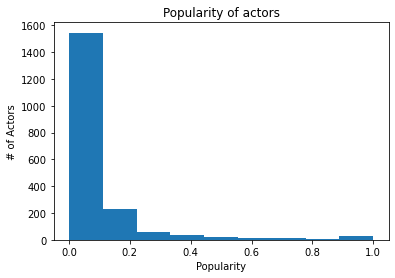
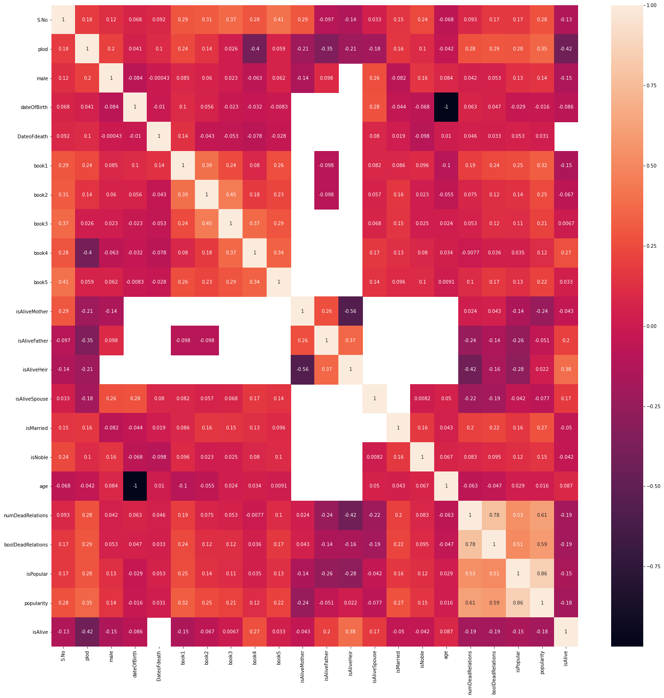

## Czy bochater bedzie żył??

Celem tej analizy jest stwierdzić czy bohater z kultowego serialu "Game of thrones" bedzię żył lub żyję na podstawie danych z pliku "game_og_thrones.csv".

## krok 1

Na początek zaimportujemy wszystkie potrzebnie biblioteki potrzebnie dla analizy.


```python
import pandas as pd
import seaborn as sns
import numpy as np
import matplotlib.pylab as plt
from scipy.spatial import distance_matrix
from sklearn import preprocessing
from scipy.cluster.hierarchy import ClusterWarning
import scipy.cluster
from scipy.cluster.hierarchy import dendrogram
import gower
from scipy.cluster import hierarchy
import matplotlib.pyplot as plt
from sklearn.model_selection import train_test_split
from sklearn.linear_model import LogisticRegression
from sklearn import metrics
from sklearn.tree import DecisionTreeClassifier
from sklearn.tree import export_graphviz
from six import StringIO
from IPython.display import Image  
import pydotplus


logreg = LogisticRegression()
label_encoder = preprocessing.LabelEncoder()
scaler = preprocessing.MinMaxScaler()
```

## krok 2

Za pomocą wbudowanej metody read_csv (biblioteka pandas) wczytujemy plik csv do zmienej "actors_data".


```python
actors_data = pd.read_csv(r'C:\Users\Irakli\Desktop\GameOfThrones\character-predictions_pose.csv', sep=',' )
```

oraz sprawdzamy czy operacja się powiodła


```python
actors_data.head()
```


<div>
<style scoped>
    .dataframe tbody tr th:only-of-type {
        vertical-align: middle;
    }

    .dataframe tbody tr th {
        vertical-align: top;
    }

    .dataframe thead th {
        text-align: right;
    }
</style>
<table border="1" class="dataframe">
  <thead>
    <tr style="text-align: right;">
      <th></th>
      <th>S.No</th>
      <th>plod</th>
      <th>name</th>
      <th>title</th>
      <th>male</th>
      <th>culture</th>
      <th>dateOfBirth</th>
      <th>DateoFdeath</th>
      <th>mother</th>
      <th>father</th>
      <th>...</th>
      <th>isAliveHeir</th>
      <th>isAliveSpouse</th>
      <th>isMarried</th>
      <th>isNoble</th>
      <th>age</th>
      <th>numDeadRelations</th>
      <th>boolDeadRelations</th>
      <th>isPopular</th>
      <th>popularity</th>
      <th>isAlive</th>
    </tr>
  </thead>
  <tbody>
    <tr>
      <th>0</th>
      <td>1</td>
      <td>0.946</td>
      <td>Viserys II Targaryen</td>
      <td>NaN</td>
      <td>1</td>
      <td>NaN</td>
      <td>NaN</td>
      <td>NaN</td>
      <td>Rhaenyra Targaryen</td>
      <td>Daemon Targaryen</td>
      <td>...</td>
      <td>0.0</td>
      <td>NaN</td>
      <td>0</td>
      <td>0</td>
      <td>NaN</td>
      <td>11</td>
      <td>1</td>
      <td>1</td>
      <td>0.605351</td>
      <td>0</td>
    </tr>
    <tr>
      <th>1</th>
      <td>2</td>
      <td>0.613</td>
      <td>Walder Frey</td>
      <td>Lord of the Crossing</td>
      <td>1</td>
      <td>Rivermen</td>
      <td>208.0</td>
      <td>NaN</td>
      <td>NaN</td>
      <td>NaN</td>
      <td>...</td>
      <td>NaN</td>
      <td>1.0</td>
      <td>1</td>
      <td>1</td>
      <td>97.0</td>
      <td>1</td>
      <td>1</td>
      <td>1</td>
      <td>0.896321</td>
      <td>1</td>
    </tr>
    <tr>
      <th>2</th>
      <td>3</td>
      <td>0.507</td>
      <td>Addison Hill</td>
      <td>Ser</td>
      <td>1</td>
      <td>NaN</td>
      <td>NaN</td>
      <td>NaN</td>
      <td>NaN</td>
      <td>NaN</td>
      <td>...</td>
      <td>NaN</td>
      <td>NaN</td>
      <td>0</td>
      <td>1</td>
      <td>NaN</td>
      <td>0</td>
      <td>0</td>
      <td>0</td>
      <td>0.267559</td>
      <td>1</td>
    </tr>
    <tr>
      <th>3</th>
      <td>4</td>
      <td>0.924</td>
      <td>Aemma Arryn</td>
      <td>Queen</td>
      <td>0</td>
      <td>NaN</td>
      <td>82.0</td>
      <td>105.0</td>
      <td>NaN</td>
      <td>NaN</td>
      <td>...</td>
      <td>NaN</td>
      <td>0.0</td>
      <td>1</td>
      <td>1</td>
      <td>23.0</td>
      <td>0</td>
      <td>0</td>
      <td>0</td>
      <td>0.183946</td>
      <td>0</td>
    </tr>
    <tr>
      <th>4</th>
      <td>5</td>
      <td>0.383</td>
      <td>Sylva Santagar</td>
      <td>Greenstone</td>
      <td>0</td>
      <td>Dornish</td>
      <td>276.0</td>
      <td>NaN</td>
      <td>NaN</td>
      <td>NaN</td>
      <td>...</td>
      <td>NaN</td>
      <td>1.0</td>
      <td>1</td>
      <td>1</td>
      <td>29.0</td>
      <td>0</td>
      <td>0</td>
      <td>0</td>
      <td>0.043478</td>
      <td>1</td>
    </tr>
  </tbody>
</table>
<p>5 rows × 30 columns</p>
</div>


## krok 3

Zbadamy dane jakego typu są czy w przypadku nie potrzebują konwersji.


```python
actors_data.info()
```

    <class 'pandas.core.frame.DataFrame'>
    RangeIndex: 1946 entries, 0 to 1945
    Data columns (total 30 columns):
     #   Column             Non-Null Count  Dtype  
    ---  ------             --------------  -----  
     0   S.No               1946 non-null   int64  
     1   plod               1946 non-null   float64
     2   name               1946 non-null   object 
     3   title              938 non-null    object 
     4   male               1946 non-null   int64  
     5   culture            677 non-null    object 
     6   dateOfBirth        433 non-null    float64
     7   DateoFdeath        444 non-null    float64
     8   mother             21 non-null     object 
     9   father             26 non-null     object 
     10  heir               23 non-null     object 
     11  house              1519 non-null   object 
     12  spouse             276 non-null    object 
     13  book1              1946 non-null   int64  
     14  book2              1946 non-null   int64  
     15  book3              1946 non-null   int64  
     16  book4              1946 non-null   int64  
     17  book5              1946 non-null   int64  
     18  isAliveMother      21 non-null     float64
     19  isAliveFather      26 non-null     float64
     20  isAliveHeir        23 non-null     float64
     21  isAliveSpouse      276 non-null    float64
     22  isMarried          1946 non-null   int64  
     23  isNoble            1946 non-null   int64  
     24  age                433 non-null    float64
     25  numDeadRelations   1946 non-null   int64  
     26  boolDeadRelations  1946 non-null   int64  
     27  isPopular          1946 non-null   int64  
     28  popularity         1946 non-null   float64
     29  isAlive            1946 non-null   int64  
    dtypes: float64(9), int64(13), object(8)
    memory usage: 456.2+ KB
    

Przydatnę bedzie równierz opis danych.


```python
actors_data.describe()
```


<div>
<style scoped>
    .dataframe tbody tr th:only-of-type {
        vertical-align: middle;
    }

    .dataframe tbody tr th {
        vertical-align: top;
    }

    .dataframe thead th {
        text-align: right;
    }
</style>
<table border="1" class="dataframe">
  <thead>
    <tr style="text-align: right;">
      <th></th>
      <th>S.No</th>
      <th>plod</th>
      <th>male</th>
      <th>dateOfBirth</th>
      <th>DateoFdeath</th>
      <th>book1</th>
      <th>book2</th>
      <th>book3</th>
      <th>book4</th>
      <th>book5</th>
      <th>...</th>
      <th>isAliveHeir</th>
      <th>isAliveSpouse</th>
      <th>isMarried</th>
      <th>isNoble</th>
      <th>age</th>
      <th>numDeadRelations</th>
      <th>boolDeadRelations</th>
      <th>isPopular</th>
      <th>popularity</th>
      <th>isAlive</th>
    </tr>
  </thead>
  <tbody>
    <tr>
      <th>count</th>
      <td>1946.000000</td>
      <td>1946.000000</td>
      <td>1946.000000</td>
      <td>433.000000</td>
      <td>444.000000</td>
      <td>1946.000000</td>
      <td>1946.000000</td>
      <td>1946.000000</td>
      <td>1946.000000</td>
      <td>1946.000000</td>
      <td>...</td>
      <td>23.000000</td>
      <td>276.000000</td>
      <td>1946.000000</td>
      <td>1946.000000</td>
      <td>433.000000</td>
      <td>1946.000000</td>
      <td>1946.000000</td>
      <td>1946.000000</td>
      <td>1946.000000</td>
      <td>1946.000000</td>
    </tr>
    <tr>
      <th>mean</th>
      <td>973.500000</td>
      <td>0.365530</td>
      <td>0.619219</td>
      <td>1577.364896</td>
      <td>2950.193694</td>
      <td>0.198356</td>
      <td>0.374615</td>
      <td>0.480473</td>
      <td>0.591984</td>
      <td>0.395170</td>
      <td>...</td>
      <td>0.652174</td>
      <td>0.778986</td>
      <td>0.141829</td>
      <td>0.460946</td>
      <td>-1293.563510</td>
      <td>0.305755</td>
      <td>0.074512</td>
      <td>0.059096</td>
      <td>0.089584</td>
      <td>0.745632</td>
    </tr>
    <tr>
      <th>std</th>
      <td>561.906131</td>
      <td>0.312637</td>
      <td>0.485704</td>
      <td>19565.414460</td>
      <td>28192.245529</td>
      <td>0.398864</td>
      <td>0.484148</td>
      <td>0.499747</td>
      <td>0.491593</td>
      <td>0.489013</td>
      <td>...</td>
      <td>0.486985</td>
      <td>0.415684</td>
      <td>0.348965</td>
      <td>0.498601</td>
      <td>19564.340993</td>
      <td>1.383910</td>
      <td>0.262669</td>
      <td>0.235864</td>
      <td>0.160568</td>
      <td>0.435617</td>
    </tr>
    <tr>
      <th>min</th>
      <td>1.000000</td>
      <td>0.000000</td>
      <td>0.000000</td>
      <td>-28.000000</td>
      <td>0.000000</td>
      <td>0.000000</td>
      <td>0.000000</td>
      <td>0.000000</td>
      <td>0.000000</td>
      <td>0.000000</td>
      <td>...</td>
      <td>0.000000</td>
      <td>0.000000</td>
      <td>0.000000</td>
      <td>0.000000</td>
      <td>-298001.000000</td>
      <td>0.000000</td>
      <td>0.000000</td>
      <td>0.000000</td>
      <td>0.000000</td>
      <td>0.000000</td>
    </tr>
    <tr>
      <th>25%</th>
      <td>487.250000</td>
      <td>0.101000</td>
      <td>0.000000</td>
      <td>240.000000</td>
      <td>282.000000</td>
      <td>0.000000</td>
      <td>0.000000</td>
      <td>0.000000</td>
      <td>0.000000</td>
      <td>0.000000</td>
      <td>...</td>
      <td>0.000000</td>
      <td>1.000000</td>
      <td>0.000000</td>
      <td>0.000000</td>
      <td>18.000000</td>
      <td>0.000000</td>
      <td>0.000000</td>
      <td>0.000000</td>
      <td>0.013378</td>
      <td>0.000000</td>
    </tr>
    <tr>
      <th>50%</th>
      <td>973.500000</td>
      <td>0.264500</td>
      <td>1.000000</td>
      <td>268.000000</td>
      <td>299.000000</td>
      <td>0.000000</td>
      <td>0.000000</td>
      <td>0.000000</td>
      <td>1.000000</td>
      <td>0.000000</td>
      <td>...</td>
      <td>1.000000</td>
      <td>1.000000</td>
      <td>0.000000</td>
      <td>0.000000</td>
      <td>27.000000</td>
      <td>0.000000</td>
      <td>0.000000</td>
      <td>0.000000</td>
      <td>0.033445</td>
      <td>1.000000</td>
    </tr>
    <tr>
      <th>75%</th>
      <td>1459.750000</td>
      <td>0.608750</td>
      <td>1.000000</td>
      <td>285.000000</td>
      <td>299.000000</td>
      <td>0.000000</td>
      <td>1.000000</td>
      <td>1.000000</td>
      <td>1.000000</td>
      <td>1.000000</td>
      <td>...</td>
      <td>1.000000</td>
      <td>1.000000</td>
      <td>0.000000</td>
      <td>1.000000</td>
      <td>50.000000</td>
      <td>0.000000</td>
      <td>0.000000</td>
      <td>0.000000</td>
      <td>0.086957</td>
      <td>1.000000</td>
    </tr>
    <tr>
      <th>max</th>
      <td>1946.000000</td>
      <td>1.000000</td>
      <td>1.000000</td>
      <td>298299.000000</td>
      <td>298299.000000</td>
      <td>1.000000</td>
      <td>1.000000</td>
      <td>1.000000</td>
      <td>1.000000</td>
      <td>1.000000</td>
      <td>...</td>
      <td>1.000000</td>
      <td>1.000000</td>
      <td>1.000000</td>
      <td>1.000000</td>
      <td>100.000000</td>
      <td>15.000000</td>
      <td>1.000000</td>
      <td>1.000000</td>
      <td>1.000000</td>
      <td>1.000000</td>
    </tr>
  </tbody>
</table>
<p>8 rows × 22 columns</p>
</div>


## krok 4

generowanie podstawowych statistik


```python
for x in actors_data[['isMarried','isNoble', 'isAlive']]:
    fig = plt.figure()
    ax = fig.add_axes([0,0,1,1])
    labels = [f'{list(set(actors_data[x].values))[0]}', f'{list(set(actors_data[x].values))[1]}']
    yes = len(actors_data[actors_data[x]==1])
    no = len(actors_data[actors_data[x]==0])
    ax.bar(labels,[yes, no])
    plt.title(x)
    plt.show()
    
```


    

    


    

    


    

    


```python
for x in actors_data[['book1','book2', 'book3', 'book4', 'book5']]:
    fig = plt.figure()
    ax = fig.add_axes([0,0,1,1])
    labels = [f'{list(set(actors_data[x].values))[0]}', f'{list(set(actors_data[x].values))[1]}']
    yes = len(actors_data[actors_data[x]==1])
    no = len(actors_data[actors_data[x]==0])
    ax.bar(labels,[yes, no])
    plt.title(x)
    plt.show()
```


    

    


    

    


    

    


    

    


    

    


```python
actors_data.popularity.hist(grid=False, bins=9)
plt.xlabel('Popularity')
plt.ylabel('# of Actors')
plt.title('Popularity of actors')
```


    Text(0.5, 1.0, 'Popularity of actors')


    

    


```python
actors_data.numDeadRelations.hist(grid=False, bins=9)
plt.xlabel('Dead realations of Actors')
plt.ylabel('# of Actiors')
plt.title('Number of Dead relationship')
```


    Text(0.5, 1.0, 'Number of Dead relationship')


    

    


## krok 5

Zeby dowiedziec które kolumny są ważnie w analizie musimy sprawdzić wzaiemna corelację. Nailepej wygenerowac macierz korelecji


```python
f,ax = plt.subplots(figsize=(25,25))
sns.heatmap(actors_data.corr(), annot = True,ax=ax)
plt.show()
```


    

    


Ze względu na to że celem analiy jest columna "isAlive" sprawdzamy korelacię odnośnie do niego.


```python
actors_data_corr_isAlive = actors_data.corr()['isAlive'].sort_values(ascending=False)
print(actors_data_corr_isAlive)
top_corr_features = actors_data_corr_isAlive.index
actors_data_corr_isAlive.plot(figsize=(10,10) ,kind='barh')
plt.show()
```

    isAlive              1.000000
    isAliveHeir          0.384900
    book4                0.268975
    isAliveFather        0.195992
    isAliveSpouse        0.174275
    age                  0.087264
    book5                0.032846
    book3                0.006693
    isNoble             -0.042211
    isAliveMother       -0.043033
    isMarried           -0.050037
    book2               -0.067200
    dateOfBirth         -0.085863
    S.No                -0.128712
    male                -0.146982
    book1               -0.147401
    isPopular           -0.153860
    popularity          -0.183223
    numDeadRelations    -0.192444
    boolDeadRelations   -0.193736
    plod                -0.417318
    DateoFdeath               NaN
    Name: isAlive, dtype: float64
    


    

    


Naiwiekszą korelacją wyrużnają się columny "plod" oraz "isAliveHeir". To trzeba sprawdzić czy dane w tych columnach są kompletne.


```python
clean_data = actors_data
```

Niestety w kulumnie "isAliveHeir" 99% wartości są puste, co dobrzę pokazuje diagram oraz obliczenia podane poniżej.


```python
actors_data.isnull().sum()
```


    S.No                    0
    plod                    0
    name                    0
    title                1008
    male                    0
    culture              1269
    dateOfBirth          1513
    DateoFdeath          1502
    mother               1925
    father               1920
    heir                 1923
    house                 427
    spouse               1670
    book1                   0
    book2                   0
    book3                   0
    book4                   0
    book5                   0
    isAliveMother        1925
    isAliveFather        1920
    isAliveHeir          1923
    isAliveSpouse        1670
    isMarried               0
    isNoble                 0
    age                  1513
    numDeadRelations        0
    boolDeadRelations       0
    isPopular               0
    popularity              0
    isAlive                 0
    dtype: int64


```python
for col in actors_data.columns:
    pct_missing = np.mean(actors_data[col].isnull())
    print('{} - {}%'.format(col, round(pct_missing*100)))
```

    S.No - 0%
    plod - 0%
    name - 0%
    title - 52%
    male - 0%
    culture - 65%
    dateOfBirth - 78%
    DateoFdeath - 77%
    mother - 99%
    father - 99%
    heir - 99%
    house - 22%
    spouse - 86%
    book1 - 0%
    book2 - 0%
    book3 - 0%
    book4 - 0%
    book5 - 0%
    isAliveMother - 99%
    isAliveFather - 99%
    isAliveHeir - 99%
    isAliveSpouse - 86%
    isMarried - 0%
    isNoble - 0%
    age - 78%
    numDeadRelations - 0%
    boolDeadRelations - 0%
    isPopular - 0%
    popularity - 0%
    isAlive - 0%
    


```python
colours = ['#000099', '#ffff00']
sns.heatmap(actors_data[actors_data.columns].isnull(), cmap=sns.color_palette(colours))
```


    <AxesSubplot:>


    

    


## krok 6

Trzeba przygotować dane do analizy oczysścic lub znornalizowac. Operacja na dole usuwa wszystkie kulumny w których brak danych wynosi podan 50%.


```python
for col in actors_data.columns:
    pct_missing = np.mean(actors_data[col].isnull())
    if round(pct_missing*100) > 50:
        clean_data.drop(col, axis=1, inplace=True)
```


```python
clean_data.head()
```


<div>
<style scoped>
    .dataframe tbody tr th:only-of-type {
        vertical-align: middle;
    }

    .dataframe tbody tr th {
        vertical-align: top;
    }

    .dataframe thead th {
        text-align: right;
    }
</style>
<table border="1" class="dataframe">
  <thead>
    <tr style="text-align: right;">
      <th></th>
      <th>S.No</th>
      <th>plod</th>
      <th>name</th>
      <th>male</th>
      <th>house</th>
      <th>book1</th>
      <th>book2</th>
      <th>book3</th>
      <th>book4</th>
      <th>book5</th>
      <th>isMarried</th>
      <th>isNoble</th>
      <th>numDeadRelations</th>
      <th>boolDeadRelations</th>
      <th>isPopular</th>
      <th>popularity</th>
      <th>isAlive</th>
    </tr>
  </thead>
  <tbody>
    <tr>
      <th>0</th>
      <td>1</td>
      <td>0.946</td>
      <td>Viserys II Targaryen</td>
      <td>1</td>
      <td>NaN</td>
      <td>0</td>
      <td>0</td>
      <td>0</td>
      <td>0</td>
      <td>0</td>
      <td>0</td>
      <td>0</td>
      <td>11</td>
      <td>1</td>
      <td>1</td>
      <td>0.605351</td>
      <td>0</td>
    </tr>
    <tr>
      <th>1</th>
      <td>2</td>
      <td>0.613</td>
      <td>Walder Frey</td>
      <td>1</td>
      <td>House Frey</td>
      <td>1</td>
      <td>1</td>
      <td>1</td>
      <td>1</td>
      <td>1</td>
      <td>1</td>
      <td>1</td>
      <td>1</td>
      <td>1</td>
      <td>1</td>
      <td>0.896321</td>
      <td>1</td>
    </tr>
    <tr>
      <th>2</th>
      <td>3</td>
      <td>0.507</td>
      <td>Addison Hill</td>
      <td>1</td>
      <td>House Swyft</td>
      <td>0</td>
      <td>0</td>
      <td>0</td>
      <td>1</td>
      <td>0</td>
      <td>0</td>
      <td>1</td>
      <td>0</td>
      <td>0</td>
      <td>0</td>
      <td>0.267559</td>
      <td>1</td>
    </tr>
    <tr>
      <th>3</th>
      <td>4</td>
      <td>0.924</td>
      <td>Aemma Arryn</td>
      <td>0</td>
      <td>House Arryn</td>
      <td>0</td>
      <td>0</td>
      <td>0</td>
      <td>0</td>
      <td>0</td>
      <td>1</td>
      <td>1</td>
      <td>0</td>
      <td>0</td>
      <td>0</td>
      <td>0.183946</td>
      <td>0</td>
    </tr>
    <tr>
      <th>4</th>
      <td>5</td>
      <td>0.383</td>
      <td>Sylva Santagar</td>
      <td>0</td>
      <td>House Santagar</td>
      <td>0</td>
      <td>0</td>
      <td>0</td>
      <td>1</td>
      <td>0</td>
      <td>1</td>
      <td>1</td>
      <td>0</td>
      <td>0</td>
      <td>0</td>
      <td>0.043478</td>
      <td>1</td>
    </tr>
  </tbody>
</table>
</div>


```python
colours = ['#000099', '#ffff00']
sns.heatmap(clean_data[clean_data.columns].isnull(), cmap=sns.color_palette(colours))
```


    <AxesSubplot:>


    

    


po czysczeniu wstępnej wydac że są braki w kolumne house trzeba braki pouzupewniać lub usunąc. W tej sytuacji wartośći tej kolumny po rostu encodujemy za pomoją "label_encoder". Dla każdej wartości bedzie przypisana wartość numericzna.


```python
for col in clean_data.columns:
    if np.issubdtype(clean_data[col].dtype, np.number) == False:
        if col == 'name': continue
        label_encoder.fit(clean_data[col].astype(str))
        clean_data[col] = label_encoder.transform(clean_data[col].astype(str))
```

nie potrzenie jest nam kolumna "S.No" poniweaż nie jest on nosnikiem wartoścowej informaji. To go usuwamy z tabeli.


```python
clean_data.drop('S.No', axis=1, inplace=True)
```


```python
clean_data = clean_data.set_index('name')
```


```python
clean_data.head()
```


<div>
<style scoped>
    .dataframe tbody tr th:only-of-type {
        vertical-align: middle;
    }

    .dataframe tbody tr th {
        vertical-align: top;
    }

    .dataframe thead th {
        text-align: right;
    }
</style>
<table border="1" class="dataframe">
  <thead>
    <tr style="text-align: right;">
      <th></th>
      <th>plod</th>
      <th>male</th>
      <th>house</th>
      <th>book1</th>
      <th>book2</th>
      <th>book3</th>
      <th>book4</th>
      <th>book5</th>
      <th>isMarried</th>
      <th>isNoble</th>
      <th>numDeadRelations</th>
      <th>boolDeadRelations</th>
      <th>isPopular</th>
      <th>popularity</th>
      <th>isAlive</th>
    </tr>
    <tr>
      <th>name</th>
      <th></th>
      <th></th>
      <th></th>
      <th></th>
      <th></th>
      <th></th>
      <th></th>
      <th></th>
      <th></th>
      <th></th>
      <th></th>
      <th></th>
      <th></th>
      <th></th>
      <th></th>
    </tr>
  </thead>
  <tbody>
    <tr>
      <th>Viserys II Targaryen</th>
      <td>0.946</td>
      <td>1</td>
      <td>346</td>
      <td>0</td>
      <td>0</td>
      <td>0</td>
      <td>0</td>
      <td>0</td>
      <td>0</td>
      <td>0</td>
      <td>11</td>
      <td>1</td>
      <td>1</td>
      <td>0.605351</td>
      <td>0</td>
    </tr>
    <tr>
      <th>Walder Frey</th>
      <td>0.613</td>
      <td>1</td>
      <td>116</td>
      <td>1</td>
      <td>1</td>
      <td>1</td>
      <td>1</td>
      <td>1</td>
      <td>1</td>
      <td>1</td>
      <td>1</td>
      <td>1</td>
      <td>1</td>
      <td>0.896321</td>
      <td>1</td>
    </tr>
    <tr>
      <th>Addison Hill</th>
      <td>0.507</td>
      <td>1</td>
      <td>264</td>
      <td>0</td>
      <td>0</td>
      <td>0</td>
      <td>1</td>
      <td>0</td>
      <td>0</td>
      <td>1</td>
      <td>0</td>
      <td>0</td>
      <td>0</td>
      <td>0.267559</td>
      <td>1</td>
    </tr>
    <tr>
      <th>Aemma Arryn</th>
      <td>0.924</td>
      <td>0</td>
      <td>23</td>
      <td>0</td>
      <td>0</td>
      <td>0</td>
      <td>0</td>
      <td>0</td>
      <td>1</td>
      <td>1</td>
      <td>0</td>
      <td>0</td>
      <td>0</td>
      <td>0.183946</td>
      <td>0</td>
    </tr>
    <tr>
      <th>Sylva Santagar</th>
      <td>0.383</td>
      <td>0</td>
      <td>237</td>
      <td>0</td>
      <td>0</td>
      <td>0</td>
      <td>1</td>
      <td>0</td>
      <td>1</td>
      <td>1</td>
      <td>0</td>
      <td>0</td>
      <td>0</td>
      <td>0.043478</td>
      <td>1</td>
    </tr>
  </tbody>
</table>
</div>


W kolumnia 'house' zawiera duże wartości żeby to nie zakłuciło dziawania analizy trzeba go zascalować.


```python
clean_data['house'] = scaler.fit_transform(clean_data[['house']])
```

Dane są gotowe dla dalszej analizy


```python
clean_data
```


<div>
<style scoped>
    .dataframe tbody tr th:only-of-type {
        vertical-align: middle;
    }

    .dataframe tbody tr th {
        vertical-align: top;
    }

    .dataframe thead th {
        text-align: right;
    }
</style>
<table border="1" class="dataframe">
  <thead>
    <tr style="text-align: right;">
      <th></th>
      <th>plod</th>
      <th>male</th>
      <th>house</th>
      <th>book1</th>
      <th>book2</th>
      <th>book3</th>
      <th>book4</th>
      <th>book5</th>
      <th>isMarried</th>
      <th>isNoble</th>
      <th>numDeadRelations</th>
      <th>boolDeadRelations</th>
      <th>isPopular</th>
      <th>popularity</th>
      <th>isAlive</th>
    </tr>
    <tr>
      <th>name</th>
      <th></th>
      <th></th>
      <th></th>
      <th></th>
      <th></th>
      <th></th>
      <th></th>
      <th></th>
      <th></th>
      <th></th>
      <th></th>
      <th></th>
      <th></th>
      <th></th>
      <th></th>
    </tr>
  </thead>
  <tbody>
    <tr>
      <th>Viserys II Targaryen</th>
      <td>0.946</td>
      <td>1</td>
      <td>0.997118</td>
      <td>0</td>
      <td>0</td>
      <td>0</td>
      <td>0</td>
      <td>0</td>
      <td>0</td>
      <td>0</td>
      <td>11</td>
      <td>1</td>
      <td>1</td>
      <td>0.605351</td>
      <td>0</td>
    </tr>
    <tr>
      <th>Walder Frey</th>
      <td>0.613</td>
      <td>1</td>
      <td>0.334294</td>
      <td>1</td>
      <td>1</td>
      <td>1</td>
      <td>1</td>
      <td>1</td>
      <td>1</td>
      <td>1</td>
      <td>1</td>
      <td>1</td>
      <td>1</td>
      <td>0.896321</td>
      <td>1</td>
    </tr>
    <tr>
      <th>Addison Hill</th>
      <td>0.507</td>
      <td>1</td>
      <td>0.760807</td>
      <td>0</td>
      <td>0</td>
      <td>0</td>
      <td>1</td>
      <td>0</td>
      <td>0</td>
      <td>1</td>
      <td>0</td>
      <td>0</td>
      <td>0</td>
      <td>0.267559</td>
      <td>1</td>
    </tr>
    <tr>
      <th>Aemma Arryn</th>
      <td>0.924</td>
      <td>0</td>
      <td>0.066282</td>
      <td>0</td>
      <td>0</td>
      <td>0</td>
      <td>0</td>
      <td>0</td>
      <td>1</td>
      <td>1</td>
      <td>0</td>
      <td>0</td>
      <td>0</td>
      <td>0.183946</td>
      <td>0</td>
    </tr>
    <tr>
      <th>Sylva Santagar</th>
      <td>0.383</td>
      <td>0</td>
      <td>0.682997</td>
      <td>0</td>
      <td>0</td>
      <td>0</td>
      <td>1</td>
      <td>0</td>
      <td>1</td>
      <td>1</td>
      <td>0</td>
      <td>0</td>
      <td>0</td>
      <td>0.043478</td>
      <td>1</td>
    </tr>
    <tr>
      <th>...</th>
      <td>...</td>
      <td>...</td>
      <td>...</td>
      <td>...</td>
      <td>...</td>
      <td>...</td>
      <td>...</td>
      <td>...</td>
      <td>...</td>
      <td>...</td>
      <td>...</td>
      <td>...</td>
      <td>...</td>
      <td>...</td>
      <td>...</td>
    </tr>
    <tr>
      <th>Luwin</th>
      <td>0.197</td>
      <td>1</td>
      <td>0.726225</td>
      <td>1</td>
      <td>1</td>
      <td>1</td>
      <td>1</td>
      <td>1</td>
      <td>0</td>
      <td>0</td>
      <td>0</td>
      <td>0</td>
      <td>1</td>
      <td>0.351171</td>
      <td>0</td>
    </tr>
    <tr>
      <th>Reek</th>
      <td>0.013</td>
      <td>1</td>
      <td>0.129683</td>
      <td>0</td>
      <td>1</td>
      <td>0</td>
      <td>1</td>
      <td>1</td>
      <td>0</td>
      <td>0</td>
      <td>0</td>
      <td>0</td>
      <td>0</td>
      <td>0.096990</td>
      <td>0</td>
    </tr>
    <tr>
      <th>Symeon Star-Eyes</th>
      <td>0.480</td>
      <td>1</td>
      <td>0.997118</td>
      <td>1</td>
      <td>1</td>
      <td>1</td>
      <td>1</td>
      <td>1</td>
      <td>0</td>
      <td>0</td>
      <td>0</td>
      <td>0</td>
      <td>0</td>
      <td>0.030100</td>
      <td>1</td>
    </tr>
    <tr>
      <th>Coldhands</th>
      <td>0.363</td>
      <td>1</td>
      <td>0.979827</td>
      <td>0</td>
      <td>0</td>
      <td>1</td>
      <td>1</td>
      <td>1</td>
      <td>0</td>
      <td>0</td>
      <td>0</td>
      <td>0</td>
      <td>0</td>
      <td>0.130435</td>
      <td>1</td>
    </tr>
    <tr>
      <th>Tytos Lannister</th>
      <td>0.907</td>
      <td>1</td>
      <td>0.475504</td>
      <td>0</td>
      <td>0</td>
      <td>1</td>
      <td>1</td>
      <td>1</td>
      <td>1</td>
      <td>1</td>
      <td>4</td>
      <td>1</td>
      <td>0</td>
      <td>0.210702</td>
      <td>0</td>
    </tr>
  </tbody>
</table>
<p>1946 rows × 15 columns</p>
</div>


## krok 7

Przygotowujemy model do przewidziwania. Trzeba podzielić dane na zbiór testowy i uczący. Poniżej definiujemy listy kolumn na bazie którego trzeba dokonać wnioskowanie oraz kolumnę decyziną.


```python
columns_for_prediction = list(clean_data.columns)
```


```python
columns_for_prediction = columns_for_prediction[:-1]
```


```python
columns_for_prediction
```


    ['plod',
     'male',
     'house',
     'book1',
     'book2',
     'book3',
     'book4',
     'book5',
     'isMarried',
     'isNoble',
     'numDeadRelations',
     'boolDeadRelations',
     'isPopular',
     'popularity']


```python
data_set_for_prediction = clean_data[columns_for_prediction]
target = clean_data.isAlive
X_train,X_test,y_train,y_test=train_test_split(data_set_for_prediction,target,test_size=0.25)
```


```python
print(f"shape of original dataset : {clean_data.shape}")
print(f"shape of input - training set : { X_train.shape}",)
print(f"shape of output - training set: {y_train.shape}")
print(f"shape of input - testing set: {X_test.shape}")
print(f"shape of output - testing set: {y_test.shape}")
```

    shape of original dataset : (1946, 15)
    shape of input - training set : (1459, 14)
    shape of output - training set: (1459,)
    shape of input - testing set: (487, 14)
    shape of output - testing set: (487,)
    

Pierwszyę wnioskowanie bedzie opartę na logiczną regresię.


```python
logreg.fit(X_train,y_train)
```


    LogisticRegression()


```python
y_pred=logreg.predict(X_test)
```


```python
y_pred
```


    array([1, 1, 1, 0, 1, 1, 1, 0, 1, 1, 1, 0, 1, 0, 1, 1, 1, 1, 1, 1, 1, 0,
           1, 1, 0, 1, 1, 1, 1, 1, 1, 0, 1, 1, 0, 0, 0, 1, 1, 1, 1, 0, 1, 1,
           1, 1, 1, 1, 1, 1, 0, 1, 1, 1, 1, 1, 1, 1, 1, 1, 1, 1, 1, 0, 1, 1,
           0, 1, 1, 1, 1, 1, 1, 1, 1, 1, 0, 1, 1, 1, 1, 1, 1, 1, 1, 1, 0, 1,
           1, 1, 1, 1, 1, 1, 1, 1, 1, 1, 0, 1, 1, 0, 1, 1, 1, 0, 1, 1, 1, 1,
           1, 1, 1, 1, 1, 1, 0, 1, 1, 1, 1, 1, 1, 1, 1, 1, 1, 1, 1, 0, 1, 1,
           1, 1, 1, 1, 1, 0, 1, 1, 1, 1, 0, 1, 1, 0, 1, 0, 1, 0, 0, 1, 1, 1,
           1, 1, 1, 1, 1, 1, 1, 1, 1, 0, 1, 1, 1, 1, 1, 1, 0, 0, 1, 1, 1, 0,
           1, 1, 0, 1, 0, 0, 1, 1, 1, 1, 1, 1, 1, 0, 0, 1, 1, 1, 1, 0, 1, 1,
           1, 1, 1, 1, 0, 1, 1, 1, 1, 1, 0, 1, 0, 1, 1, 1, 0, 1, 1, 1, 0, 1,
           1, 1, 1, 1, 1, 0, 1, 1, 1, 1, 1, 0, 1, 1, 1, 1, 1, 1, 1, 1, 0, 1,
           1, 1, 1, 1, 1, 0, 1, 1, 1, 1, 1, 0, 1, 1, 1, 1, 1, 1, 0, 1, 1, 1,
           0, 1, 1, 1, 1, 1, 1, 1, 1, 1, 1, 1, 1, 1, 0, 0, 1, 0, 1, 1, 1, 1,
           1, 1, 0, 1, 0, 1, 1, 0, 1, 1, 0, 1, 0, 0, 1, 1, 1, 1, 1, 1, 1, 1,
           1, 1, 1, 1, 1, 1, 0, 0, 1, 0, 1, 1, 1, 1, 1, 0, 1, 1, 1, 1, 1, 1,
           1, 1, 0, 1, 1, 1, 1, 1, 0, 1, 0, 1, 1, 1, 1, 1, 0, 1, 1, 1, 0, 0,
           1, 1, 1, 0, 1, 1, 1, 1, 0, 1, 1, 1, 1, 1, 0, 0, 1, 1, 1, 1, 1, 1,
           1, 1, 1, 1, 1, 1, 1, 0, 1, 1, 1, 1, 1, 1, 1, 1, 1, 1, 1, 1, 0, 1,
           1, 1, 1, 1, 1, 0, 1, 1, 1, 1, 1, 0, 1, 1, 1, 1, 1, 1, 1, 1, 1, 1,
           1, 1, 1, 1, 0, 1, 1, 1, 1, 1, 1, 0, 1, 1, 1, 1, 1, 1, 1, 1, 1, 1,
           1, 1, 0, 0, 1, 1, 1, 1, 1, 1, 1, 1, 1, 1, 1, 1, 1, 0, 1, 1, 1, 1,
           1, 1, 0, 1, 1, 1, 1, 1, 1, 1, 1, 1, 1, 1, 0, 1, 1, 1, 1, 1, 0, 1,
           1, 1, 1], dtype=int64)


Winiki wnioskowanie możemy wizualizowac i stworzyć macież pomiłek


```python
cnf_matrix = metrics.confusion_matrix(y_test, y_pred)
cnf_matrix
```


    array([[ 56,  71],
           [ 28, 332]], dtype=int64)


```python
print(f"Accuracy: {metrics.accuracy_score(y_test, y_pred)}")
print(f"Precision: {metrics.precision_score(y_test, y_pred)}")
print(f"Recall: {metrics.recall_score(y_test, y_pred)}")
```

    Accuracy: 0.7967145790554415
    Precision: 0.8238213399503722
    Recall: 0.9222222222222223
    


```python
class_names=[0,1]
fig, ax = plt.subplots()
tick_marks = np.arange(len(class_names))
plt.xticks(tick_marks, class_names)
plt.yticks(tick_marks, class_names)
# create heatmap
sns.heatmap(pd.DataFrame(cnf_matrix), annot=True, cmap="YlGnBu" ,fmt='g')
ax.xaxis.set_label_position("top")
plt.tight_layout()
plt.title('Confusion matrix', y=1.1)
plt.ylabel('Actual label')
plt.xlabel('Predicted label')
```


    Text(0.5, 257.44, 'Predicted label')


    

    


Drugi model deciziny bedzie oparty na drzewach decizynich. Poniżey do clasifikatora przekazumey te samę dane co do logicznej regresii.


```python
clf = DecisionTreeClassifier()
clf = clf.fit(X_train,y_train)
y_pred = clf.predict(X_test)
```

Możemy sprawdzić wygenerowane drzewo.


```python
dot_data = StringIO()
export_graphviz(clf, out_file=dot_data,  
                filled=True, rounded=True,
                special_characters=True,feature_names = columns_for_prediction,class_names=['0','1'])
graph = pydotplus.graph_from_dot_data(dot_data.getvalue())  
graph.write_png('game_of_throne_tree.png')
Image(graph.create_png())
```


    

    


```python
print(f"Accuracy: {metrics.accuracy_score(y_test, y_pred)}")
print(f"Precision: {metrics.precision_score(y_test, y_pred)}")
print(f"Recall: {metrics.recall_score(y_test, y_pred)}")
```

    Accuracy: 0.7802874743326489
    Precision: 0.8543417366946778
    Recall: 0.8472222222222222
    


```python
cnf_matrix = metrics.confusion_matrix(y_test, y_pred)
cnf_matrix
```


    array([[ 75,  52],
           [ 55, 305]], dtype=int64)


```python
class_names=[0,1]
fig, ax = plt.subplots()
tick_marks = np.arange(len(class_names))
plt.xticks(tick_marks, class_names)
plt.yticks(tick_marks, class_names)
# create heatmap
sns.heatmap(pd.DataFrame(cnf_matrix), annot=True, cmap="YlGnBu" ,fmt='g')
ax.xaxis.set_label_position("top")
plt.tight_layout()
plt.title('Confusion matrix', y=1.1)
plt.ylabel('Actual label')
plt.xlabel('Predicted label')
```


    Text(0.5, 257.44, 'Predicted label')


    

    


Na koniec możemy porównać obie dwa modele i zdecodować które bardzej pasuje dla nas
